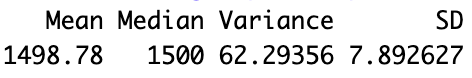
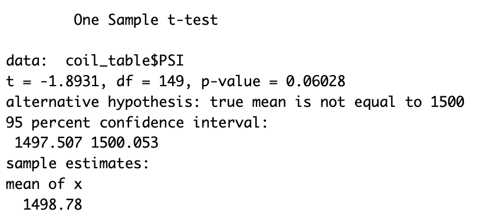
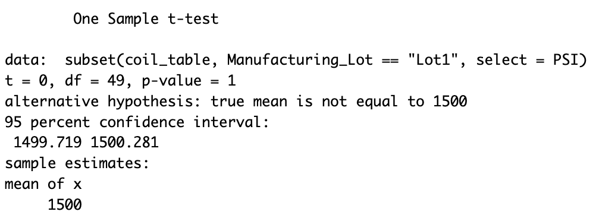
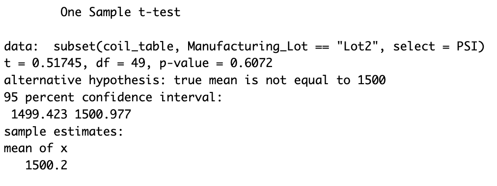
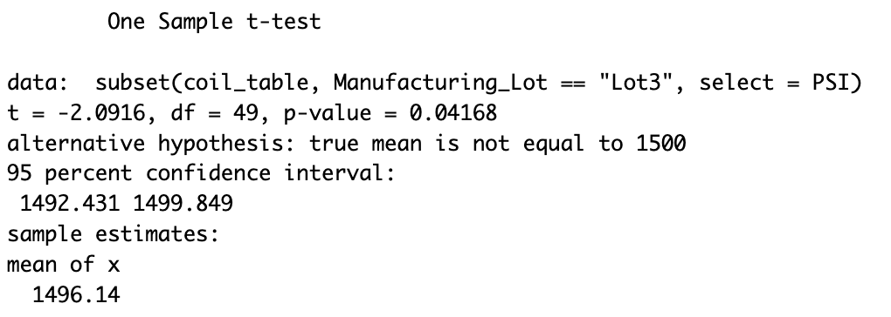

# Analysis
### Overview
AutosRUs’ newest prototype, the MechaCar, is suffering from production troubles that are blocking the manufacturing team’s progress. You've been asked to review the production data for insights that may help the manufacturing team.

<b>Tasks</b>
- Perform multiple linear regression analysis to identify which variables in the dataset predict the mpg of MechaCar prototypes.
- Collect summary statistics on the pounds per square inch (PSI) of the suspension coils from the manufacturing lots.
- Run t-tests to determine if the manufacturing lots are statistically different from the mean population.
- Design a statistical study to compare vehicle performance of the MechaCar vehicles against vehicles from other manufacturers.
- Write a summary interpretation of the findings for each statistical analysis.

### Data Description
<b>MechaCar_MPG Dataset:</b> The MechaCar_mpg dataset contains mpg test results for 50 prototype MechaCars. The MechaCar prototypes were produced using multiple design specifications to identify ideal vehicle performance. Multiple metrics, such as vehicle length, vehicle weight, spoiler angle, drivetrain, and ground clearance, were collected for each vehicle.

<b>Suspension_Coil Dataset:</b> The MechaCar Suspension_Coil.csv dataset contains the results from multiple production lots. In this dataset, the weight capacities of multiple suspension coils were tested to determine if the manufacturing process is consistent across production lots. 

## Linear Regression to Predict MPG
According to our results, "vehicle lentgth" and "ground clearance" (along with the intercept) are statistically unlikely to provide random amounts of variance to mpg (miles per gallon) values in the dataset. This suggestions that these variable have a significant impact on vehicle performance. 

The p-value of our linear regression analysis is extremely small (5.35 x 10^-11), which is much smaller than our assumed significance level of 0.05%. Therefore, confidently reject the null hypothesis that the slope of our linear model is zero. This implies that there is a significant relationship between the independent variables (such as vehicle length and ground clearance) and the dependent variable (mpg).

The multiple R-squared value of 0.7149 indicates a strong relationship between the independent variables and the dependent variable. This means that approximately 71.49% of the variance in the mpg values can be explained by the independent variables in the model. Therefore, the linear model is likely to predict the mpg of MechaCar prototypes effectively.
).png)

## Summary Statistics on Suspension Coils
The design specifications for the MechaCar suspension coils dictate that the variance of the suspension coils must not exceed 100 pounds per square inch.

<b>Total Summary</b>

The total summary provides an overall view of the variance across all manufacturing lots. The variance value calculated from the total summary is 62.29356 PSI, which is below the specified threshold of 100 PSI. Based on the total summary, the manufacturing data meets the design specification.

<b>Lot Summary</b>

Analyzing the variance values for each manufacturing lot, Lot 1 has a variance of 0.980 PSI, Lot 2 has a variance of 7.47 PSI, and Lot 3 has a variance of 170 PSI. For Lot 1 and Lot 2, the variance is well below the specified threshold of 100 PSI, showing that these lot meets the design specification. However, Lot 3 exceeds the threshold, having a significantly higher variance of 170 PSI.

In conclusion, the total manufacturing data meets the design specification, as the overall variance is below the specified threshold. However, when examining each manufacturing lot individually, Lot 3 does not meet the design specification, as it's variance value exceeds the threshold.

## T-Test on Suspension Coils
<b>PSI vs Population</b>

Since the p-value (0.06028) is greater than the significance level of 0.05, we fail to reject the null hypothesis. This means that we do not have enough evidence to claim that the mean PSI of the MechaCar suspension coils is statistically different from the population mean of 1500 pounds per square inch.

<b>Manufacturing lot vs Population: Lot 1</b>

With a p-value of 1, we fail to reject the null hypothesis. There is no statistically significant difference between the mean PSI of Lot 1 and the population mean at the 5% significance level.

<b>Manufacturing lot vs Population: Lot 2</b>

With a p-value of 0.6072, we fail to reject the null hypothesis. There is no statistically significant difference between the mean PSI of Lot 2 and the population mean at the 5% significance level.

<b>Manufacturing lot vs Population: Lot 3</b>

With a p-value of 0.04168, we reject the null hypothesis. There is a statistically significant difference between the mean PSI of Lot 3 and the population mean at the 5% significance level.

In summary, for Lot 1 and Lot 2, there is no evidence to suggest that the mean PSI is different from the population mean of 1500 PSI. However, for Lot 3, there is evidence that the mean PSI is statistically different.

## Study Design: MechaCar vs Competition
This statistical study aims to quantify how the MechaCar performs against its competitors in terms of city fuel efficiency (miles per gallon, mpg). Fuel efficiency is an important metric for consumers as it directly impacts their daily commuting costs and environmental footprint. Fuel efficiency vehicles require less gas, reducing air polloution and cutting global emissions. MechaCar's fuel efficiency will be compared to the average fuel efficiency of its main competitors in the same vehicle class.

The metric to be tested is city fuel efficiency (mpg). This metric represents the number of miles a vehicle can travel per gallon of fuel in urban driving conditions. For our null hypothesis, we hypothesize that MechaCar's city fuel efficiency is equal to the average city fuel efficiency of its competitors. The alternative hypothesis is that MechaCar's city fuel efficiency is different from it's competitor's average city fuel efficiency. To test this hypothesis, we will use a two-sample t-test because it compares the means of two independent samples to determine if there is a statistically significant difference between them. In this case, the test will determine if there is a significant difference between MechaCar's city fuel efficiency and the average city fuel efficiency of its competitors.

To run our two-sample t-test, we will need a random sample of city fuel efficiency data from MechaCar and it's competitors for each vehicle class. The sample data should include enough values to provide reliable estimates of our population mean and should also include other variables, such as vehicle weight, engine size, transmisison type, and so on. This should help us identify variables that can distort or obscure the true relationship between the independent and dependent variables in our study.

By conducting this statistical study, we can provide valuable insights into how MechaCar's city fuel efficiency compares to its competitors, helping consumers make informed decisions about their vehicle purchases.
